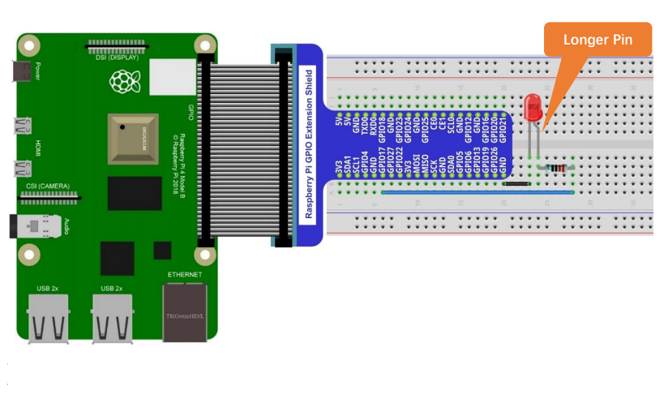

# 01: Blinking LED
The purpose of this project is to connect an LED to the Raspberry Pi GPIO and make it blink on/off until the user exits the program.

## Wiring Schematic


## Wiring Diagram


## C Code
The C code is available in the `c` folder.
```
cd c
```
Run the following command to compile the C code.
```
gcc blink.c -o out/blink -lwiringPi
```
You can run the program with the following command.
```
./out/blink
```
Press `CTRL+C` to exit the program.

## Python Code
The Python code is available in the `python` folder.
```
cd python
```
You can run the program with the following command.
```
python blink.py
```
Press `CTRL+C` to exit the program.