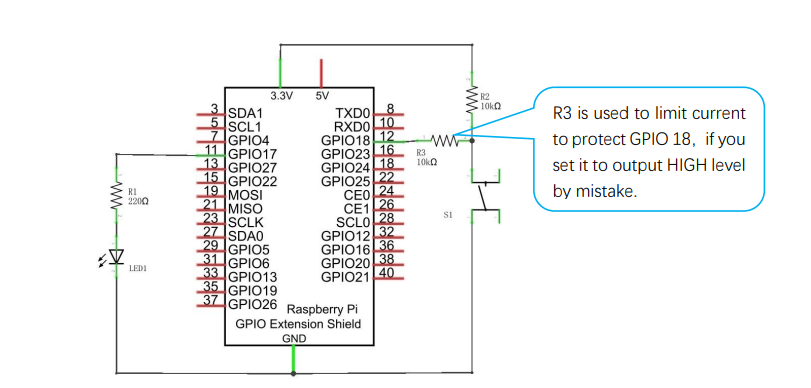
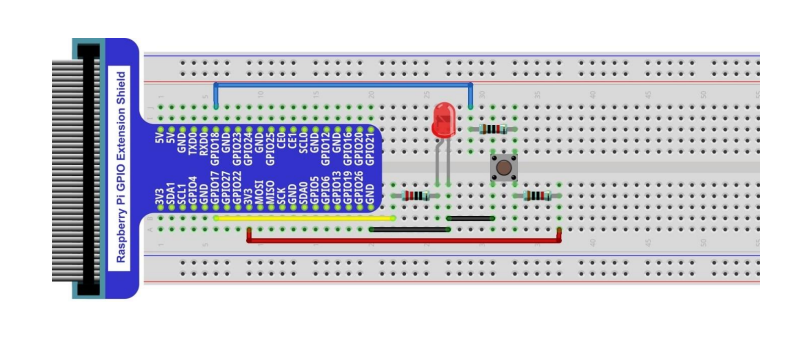

# 02: Flashlight
The purpose of this project is to connect an LED to the Raspberry Pi GPIO and control it using a push-button switch. There are two versions of the source code so that the button can be configured as either a momentary or a toggle switch. The type of push-button switch used in this project is called a **single pole, single throw** switch, or **SPST** for short.

## Wiring Schematic


## Wiring Diagram


## C Code
The C code is available in the `c` folder.
```
cd c
```
Run the following command(s) to compile the C code.
```
gcc flashlight.c -o out/blink -lwiringPi
gcc flashlight2.c -o out/blink -lwiringPi
```
You can run the program(s) with the following command(s).
```
./out/flashlight
./out/flashlight2
```
Press `CTRL+C` to exit the program(s).

## Python Code
The Python code is available in the `python` folder.
```
cd python
```
You can run the program(s) with the following command.
```
python flashlight.py
python flashlight2.py
```
Press `CTRL+C` to exit the program(s).