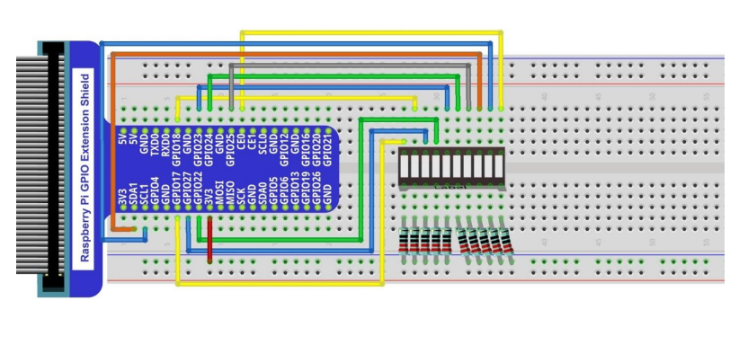

# 03: LED Bar Graph
The purpose of this project is to connect an LED bar graph to the Raspberry Pi GPIO and create the effect of flowing water by turning each LED on/off in sequence.

## Wiring Schematic


## Wiring Diagram


## C Code
The C code is available in the `c` folder.
```
cd c
```
Run the following command(s) to compile the C code.
```
gcc flowing-water.c -o out/flowing-water -lwiringPi
```
You can run the program(s) with the following command(s).
```
./out/flowing-water
```
Press `CTRL+C` to exit the program(s).

## Python Code
The Python code is available in the `python` folder.
```
cd python
```
You can run the program(s) with the following command.
```
python flowing-water.py
```
Press `CTRL+C` to exit the program(s).