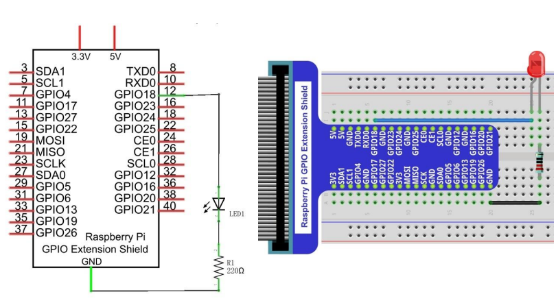

# 03: PWM LED
The purpose of this project is to connect an LED to the Raspberry Pi GPIO and create the effect of breathing by using pulse-width modulation (PWM) to emulate analog input thus slowly turning the LED on/off.

## Wiring Diagram & Schematic


## C Code
The C code is available in the `c` folder.
```
cd c
```
Run the following command(s) to compile the C code.
```
gcc breathing-led.c -o out/breathing-led -lwiringPi
```
You can run the program(s) with the following command(s).
```
./out/breathing-led
```
Press `CTRL+C` to exit the program(s).

## Python Code
The Python code is available in the `python` folder.
```
cd python
```
You can run the program(s) with the following command.
```
python breathing-led.py
```
Press `CTRL+C` to exit the program(s).