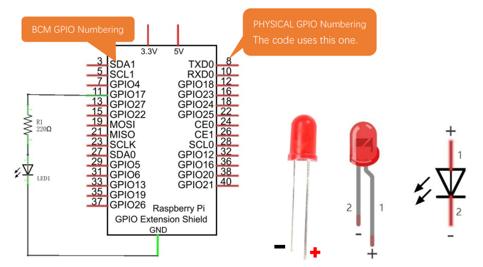
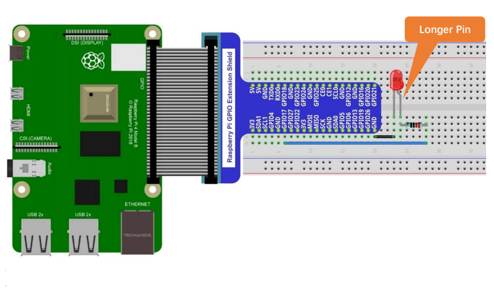
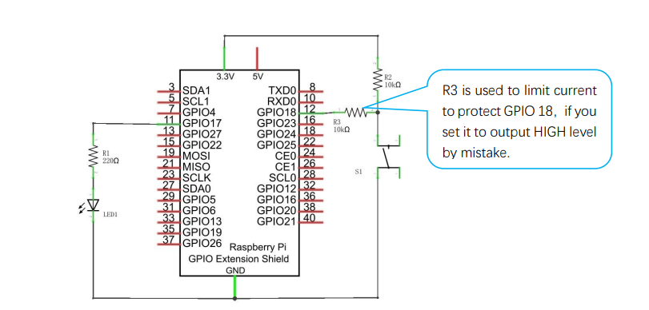
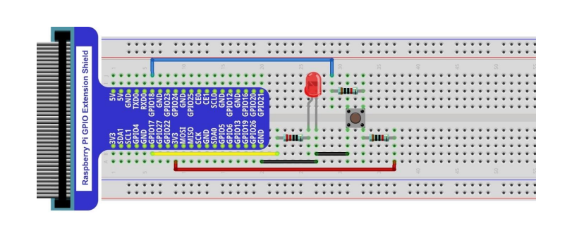
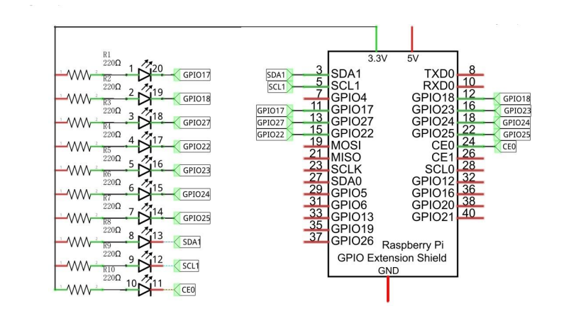
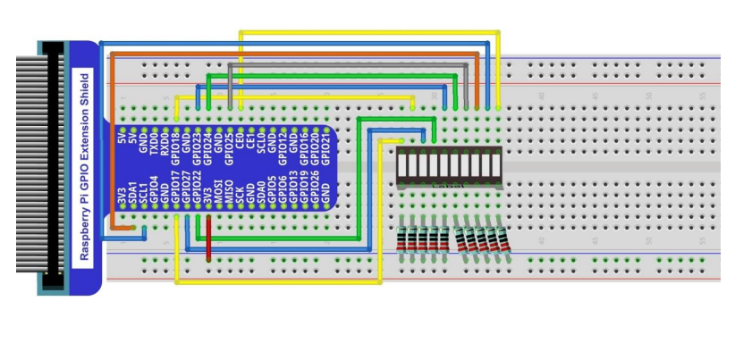
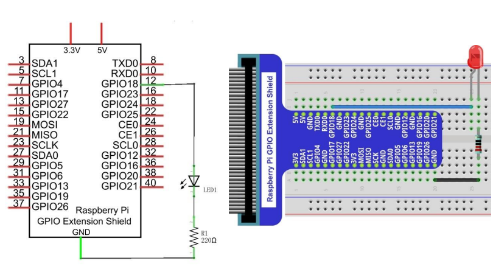

# glowing-giggle

# Table of Contents
- [glowing-giggle](#glowing-giggle)
- [Table of Contents](#table-of-contents)
- [Introduction](#introduction)
- [Pre-Requisites](#pre-requisites)
  - [WiringPi](#wiringpi)
- [Component Knowledge](#component-knowledge)
  - [Resistor](#resistor)
  - [Diode](#diode)
  - [LED](#led)
  - [Switch](#switch)
- [Projects](#projects)
  - [Simple LED](#simple-led)
    - [C Code](#c-code)
    - [Python Code](#python-code)
    - [Wiring Schematic](#wiring-schematic)
    - [Wiring Diagram](#wiring-diagram)
  - [Push-Button LED](#push-button-led)
    - [Wiring Schematic](#wiring-schematic-1)
    - [Wiring Diagram](#wiring-diagram-1)
  - [LED Bar Graph](#led-bar-graph)
    - [Wiring Schematic](#wiring-schematic-2)
    - [Wiring Diagram](#wiring-diagram-2)
  - [PWM LED](#pwm-led)
    - [Wiring Diagram \& Schematic](#wiring-diagram--schematic)
  - [RGB LED](#rgb-led)

# Introduction

TBD

# Pre-Requisites

## WiringPi
WiringPi is a PIN based GPIO access library written in C for the BCM2835, BCM2836 and BCM2837 SoC devices used in all Raspberry Pi. versions. To install the WiringPi library, run the following commands.

```
git clone https://github.com/WiringPi/WiringPi
cd WiringPi
./build
```

# Component Knowledge

## Resistor
A resistor an electrical component that is used to reduce current flow, adjust signal levels, to divide voltages, bias active elements, and terminate transmission lines, among other uses. Resistance is measured in Ohms (Ω) and behaves according to Ohm's Law.


The total resistance of resistors connected in series is the sum of their individual resistance values.


The total resistance of resistors connected in parallel is the reciprocal of the sum of the reciprocals of the individual resistors.


## Diode
A diode is and electrical component that conducts current primarily in one direction The most common function of a diode is to allow an electric current to pass in one direction (called the diode's forward direction), while blocking it in the opposite direction (the reverse direction). As such, the diode can be viewed as an electronic version of a check valve. This unidirectional behavior is called rectification and is used to convert alternating current (AC) to direct current (DC). As rectifiers, diodes can be used for such tasks as extracting modulation from radio signals in radio receivers.


## LED
A light-emitting diode (LED) is a special type of diode that emits light when current flows through it in the correct direction. LEDs have many advantages over incandescent light sources, including lower power consumption, longer lifetime, improved physical robustness, smaller size, and faster switching. The long lead on a simple LED is called an anode (+) and the shorter lead is called a cathode (-).


## Switch
A switch is an electronic component or device that can switch an electrical circuit, interrupting the current or diverting it from one conductor to another. Electronic switches are considered binary devices because they can be on or off. The table below outlines a few basic types of electronic switches.

| Abbreviation | Name | Description | Symbol |
| ----------- | ----------- | ----------- | ----------- |
| SPST | Single-Pole Single-Throw | A simple on-off switch. |  |
| SPDT | Single-Pole Double-Throw | A simple changeover switch. Some suppliers use SPCO/SPTT for switches with a stable off position in the centre and SPDT for those without. |  |
| DPST | Double-Pole Single-Throw | Equivalent to two SPST switches controlled by a single mechanism. |  |
| DPDT | Double-Pole Double-Throw | Equivalent to two SPDT switches controlled by a single mechanism. |  |

# Projects

## Simple LED

The purpose of this project is to connect a(n) LED to the Raspberry Pi GPIO and make it blink on/off until the user exits the program.

### C Code
The following command builds and runs the C code.
```
gcc projects/01_simple-led/c/simple-led.c -o out/simple-led -lwiringPi && ./simple-led 
```
You can exit the program by pressing `Ctrl + c`.

### Python Code
The following command runs the Python code.
```
python projects/01_simple-led/python/simple-led.py
```
You can exit the program by pressing `Ctrl + c`.

### Wiring Schematic
Below is the wiring schematic used in this project.


### Wiring Diagram
Below is a sample wiring diagram that adheres to the schematic.


## Push-Button LED

The purpose of this project is to connect a(n) LED to the Raspberry Pi GPIO and control it in two ways using a push-button switch. There are two versions of the source code so that the button can be configured as either a momentary or a toggle switch.

### Wiring Schematic


### Wiring Diagram


## LED Bar Graph

The purpose of this project is to connect a(n) LED bar graph to the Raspberry Pi GPIO and create an oscillating/flowing effect by turning each LED on/off in sequence.

### Wiring Schematic


### Wiring Diagram


## PWM LED

The purpose of this project is to connect a(n) LED to the Raspberry Pi GPIO and create a glowing/breathing effect by using pulse-width modulation (PWM) to emulate analog input thus slowly turning the LED on/off.

### Wiring Diagram & Schematic


## RGB LED

TBD
