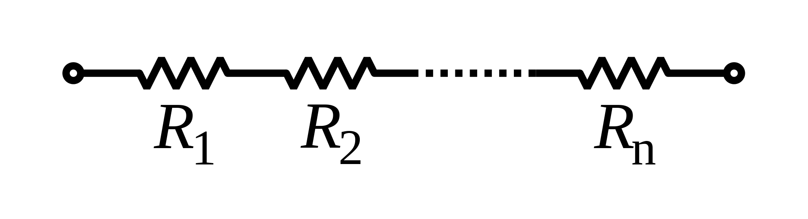
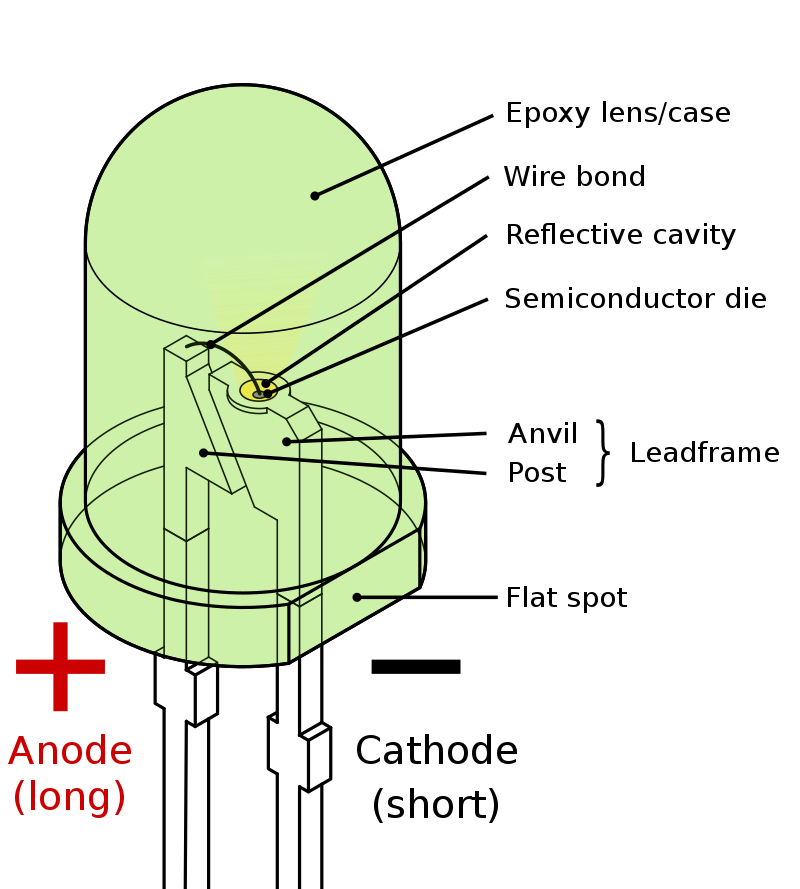

# glowing-giggle

## Component Knowledge

### Resistor
A resistor is a passive two-terminal electrical component that implements electrical resistance as a circuit element. In electronic circuits, resistors are used to reduce current flow, adjust signal levels, to divide voltages, bias active elements, and terminate transmission lines, among other uses. Resistance is measured in Ohms (Ω) and behaves according to Ohm's Law.

The total resistance of resistors connected in series is the sum of their individual resistance values.

The total resistance of resistors connected in parallel is the reciprocal of the sum of the reciprocals of the individual resistors.

### LED
A light-emitting diode (LED) is a semiconductor device that emits light when current flows through it. LEDs have many advantages over incandescent light sources, including lower power consumption, longer lifetime, improved physical robustness, smaller size, and faster switching.
